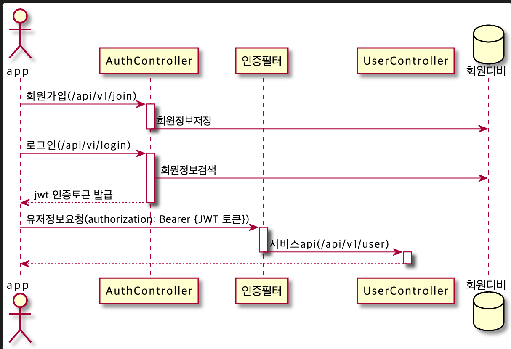

# spring security demo
spring security 사용한 인증 데모

## 키 발급
```
keytool -genkeypair -alias 앨리어스명 -keyalg 암호알고리즘 -keypass 키패스워드 -keystore 키스토어명 -storepass 스토어패스워드
keytool -genkeypair -alias proc -keyalg RSA -keypass proc123 -keystore proc.jks -storepass proc
```

## jwt 라이브러리
### Nimbus JOSE+JWT
* https://bitbucket.org/connect2id/nimbus-jose-jwt/src/master/
* Open source Apache 2.0 license
* jjwt보다 더 많은 기능을 제공 
* spring security oauth2 에 포함되어 있음

### jwt
* https://github.com/jwtk/jjwt
* Open source Apache 2.0 license
* 단순하고 사용하기 쉬음
* 많이 사용함
* 현 데모에 사용

### auth0 java-api
* https://github.com/auth0/java-jwt
* MIT license

## API
* v1 버전에는 로그아웃 기능이 지원 안됨
* 로그인후 헤드에 발급받은 토큰을 세팅하여 접근 가능 (authorization: Bearer {발급받은 토큰})
* WebSecurityConfig 설정에서 OAuth 2.0 리소스 서버(oauth2ResourceServer(OAuth2ResourceServerConfigurer::jwt)에 대한 JWT 전달자 토큰 지원을 활성화
* JwtDecoder 빈 설정 하여 spring security에서 jwt 토큰을 복호화 할수 있도록 해야 

#### 로그아웃 처리는?
* 토큰을 저장하여 접근시 체크한다.
  * 로그인시 저장하여 필터에서 로그아웃된 토큰인지 검증
  * jwt의 장점인 stateless를 잃어 버린 느낌
* 토큰 타임아웃 값을 짦게 유지하고 로그아웃시 클라이언트에서만 삭제
  * 토큰이 삭제 안되고 계속 남아있으면?

## V1
### 시퀀스


### 1. 회원가입_v1
> [POST] /api/v1/join
```
curl -X POST http://localhost:8080/api/v1/join -H 'cache-control: no-cache' -H 'content-type: application/json' -d '{ "email":"abcd123@gmail.com", "password":"abcd1234"}'
```

### 2. 로그인_v1
* 로그인 후 JWT 발급
> [POST] /api/v1/login
```
curl -X POST http://localhost:8080/api/v1/login -H 'cache-control: no-cache' -H 'content-type: application/json' -d '{ "email":"abcd123@gmail.com", "password":"abcd1234"}'
```

### 3. 유저정보 확인_v1
> [GET] /api/v1/user
```
curl -X GET http://localhost:8080/api/v1/user -H 'authorization: Bearer {JWT 토큰}' -H 'cache-control: no-cache' -H 'content-type: application/json'
```

## V2
* OAuth2.0 
* access token, refresh token
* 로그아웃 처리는 accesstoken를 Blacklist(레디스) 저장해서 체크

### 1. 로그인_v2
* 로그인후 access token, refresh token 발급
> [POST] /api/v2/login
```
curl -X POST http://localhost:8080/api/v2/login -H 'cache-control: no-cache' -H 'content-type: application/json' -d '{ "email":"test0001@gmail.com", "password":"abcd1234"}'
```

### 2. 유저정보_v2
> [GET] /api/v2/user
```
curl -X GET http://localhost:8080/api/v1/user -H 'authorization: Bearer {access token}' -H 'cache-control: no-cache' -H 'content-type: application/json'
```

### 3. 로그아웃_v2
> [POST] /api/v2/logout
```
curl -X POST http://localhost:8080/api/v2/logout -H 'cache-control: no-cache' -H 'content-type: application/json' -d '{ "accessToken":"{발급받은 access token}", "refreshToken":"{발급받은 refresh token}"}'
```

#### 4. 토큰갱신
> [POST] /api/v2/renew
```
curl -X POST http://localhost:8080/api/v2/renew -H 'cache-control: no-cache' -H 'content-type: application/json' -d '{ "accessToken":"{발급받은 access token}", "refreshToken":"{발급받은 refresh token}"}'
```